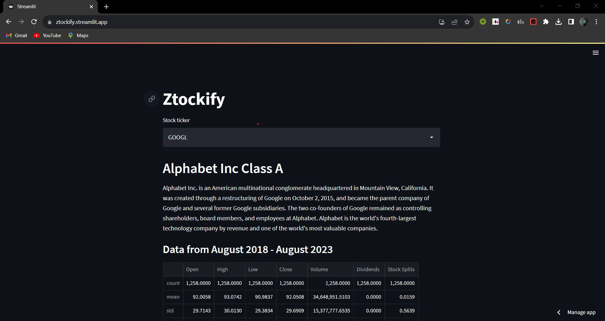
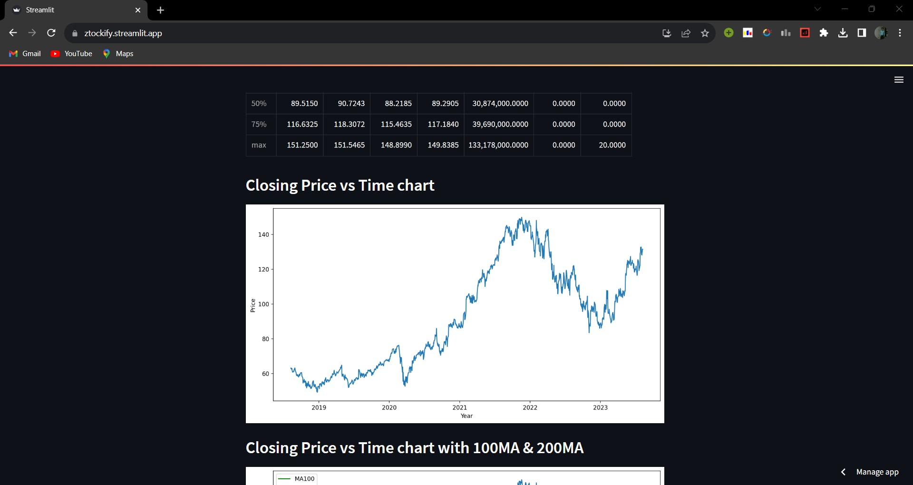
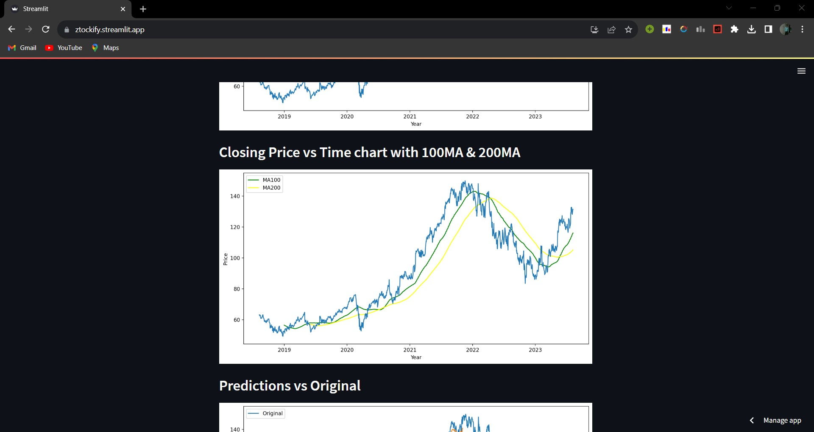
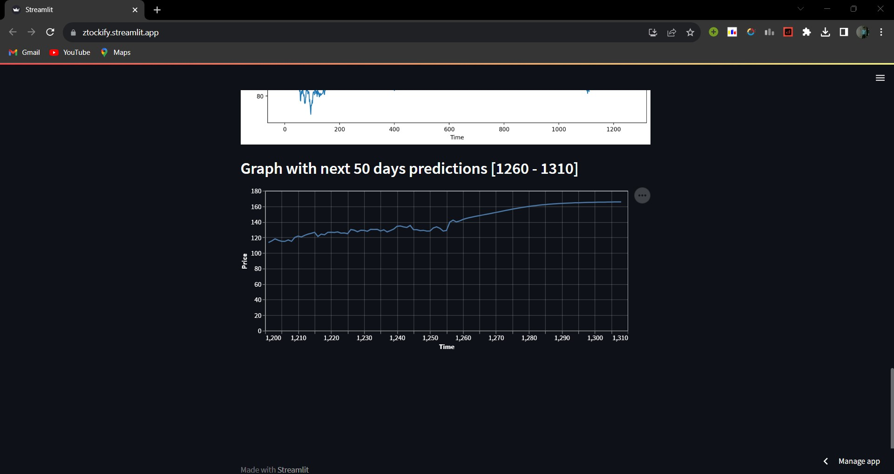

# Ztockify and its Applications
Ztockify is a web application which predicts stock prices. It is trained using Long Short Term Memory(LSTMs)
on past 200 days stock to predict next 50 days stock prices. Stock Price Prediction using machine learning helps you discover the future value of company stock and other financial assets traded on an exchange. The entire idea of predicting stock prices is to gain significant profits. Predicting how the stock market will perform is a hard task to do. There are other factors involved in the prediction, such as physical and psychological factors, rational and irrational behavior, and so on. All these factors combine to make share prices dynamic and volatile. This makes it very difficult to predict stock prices with high accuracy. 

Although this is a static website, I wanted to learn deployment of machine learning apps so I used streamlit and its cloud community to deploy the app. 
[Website Link](https://ztockify.streamlit.app/)

# Algorithm and Feature Selection
LSTM could not process a single data point. it needs a sequence of data for processing and able to store historical information. LSTM is an appropriate algorithm to make prediction and process based-on time-series data. It’s better to work on the regression problem. The stock market has enormously historical data that varies with trade date, which is time-series data, but the LSTM model predicts future price of stock within a short-time period with higher accuracy when the dataset has a huge amount of data. Since closing price determinies the loses, gains and tells about overall performance of the company o that day it is the best feature to consider. 

# Technologies Used
 - pandas_datareader for extracting stock data
 - yfinance for company information
 - numpy for mathematical calculations
 - pandas for handling dataframe
 - matplotlib for plotting graphs
 - tensorflow-cpu and keras for importing sequential models
 - scikit_learn for model implementations
 - streamlit for frontend design
 - altair for displaying predictions
# Overview

 - **Stock Ticker and Company Description**
 
 
 
  - **Closing price vs Time chart**
 
 
 
   - **Moving averages**
 
 

   - **Predictions on next 50 days**
 
 